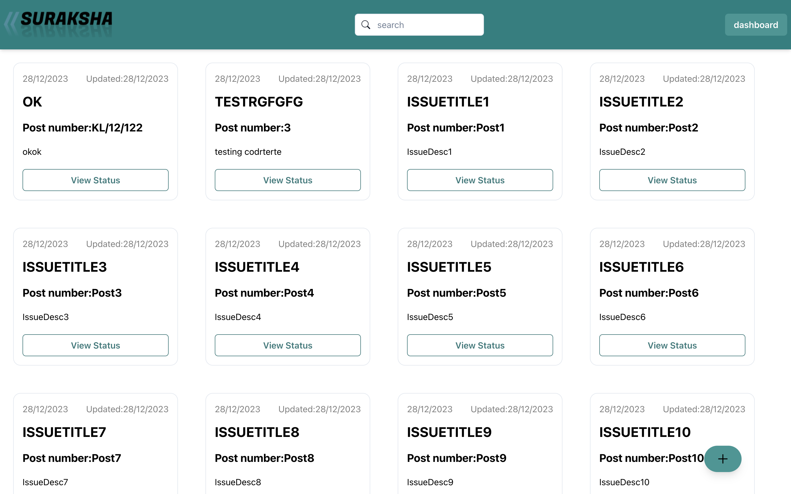
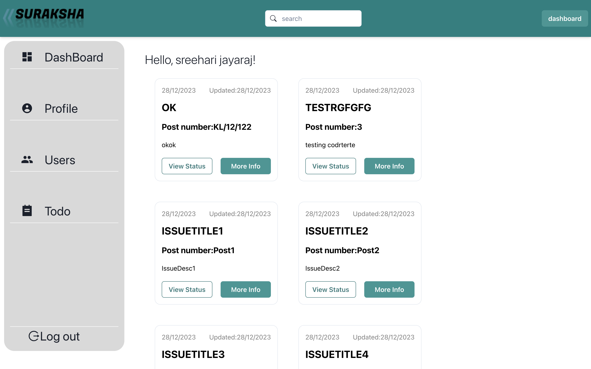
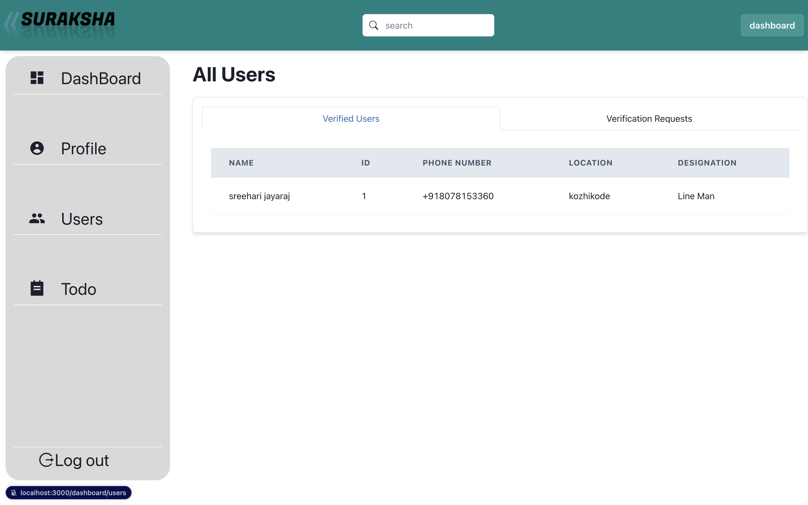
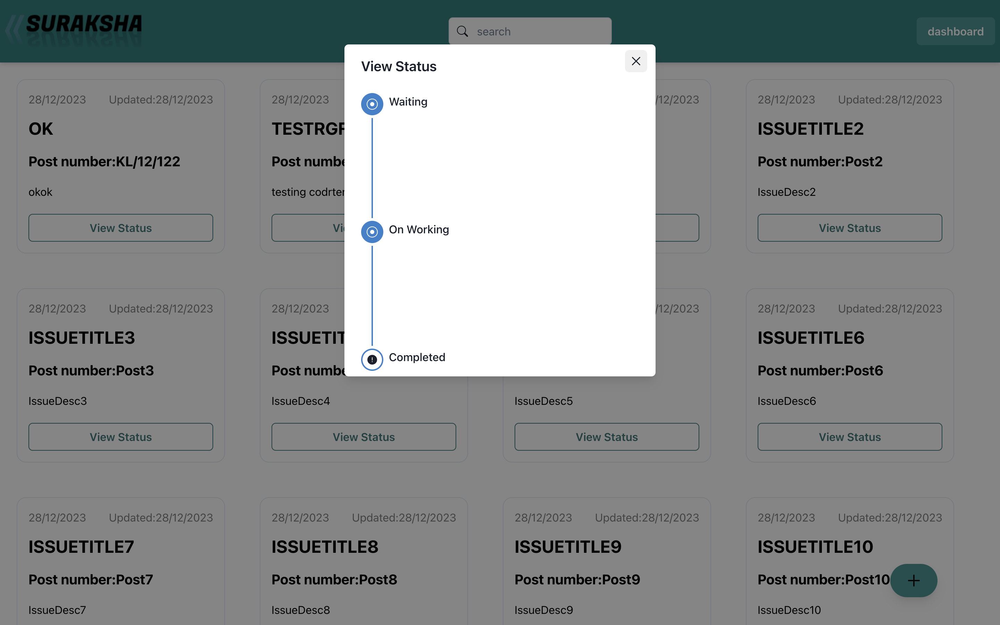
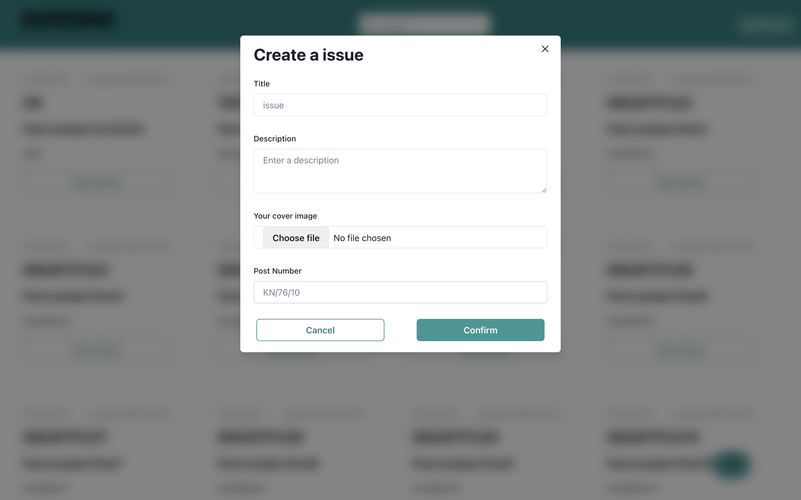

[![Contributors][contributors-shield]][contributors-url]
[![Forks][forks-shield]][forks-url]
[![Stargazers][stars-shield]][stars-url]
[![Issues][issues-shield]][issues-url]
[![MIT License][license-shield]][license-url]

<!-- PROJECT LOGO -->
<br />
<div align="center">

# <h1 align="center">KSEB</h1>

  <p align="center">
    We ensure security for kseb workers from their on-Site working environment 
    <br />
  </p>
</div>

<!-- TABLE OF CONTENTS -->
<details>
  <summary>Table of Contents</summary>
  <ol>
    <li>
      <a href="#about-the-project">About The Project</a>
      <ul>
        <li><a href="#built-with">Built With</a></li>
      </ul>
    </li>
    <li>
      <a href="#getting-started">Getting Started</a>
      <ul>
        <li><a href="#prerequisites">Prerequisites</a></li>
        <li><a href="#installation">Installation</a></li>
      </ul>
    </li>
  </ol>
</details>

<!-- ABOUT THE PROJECT -->

## About The Project

This is a mobile App for kseb workers to ensure thier security from human errors on site

<p align="right">(<a href="#top">back to top</a>)</p>

### Built With

- [NEXT JS](https://nextjs.org/)
- [Go-Lang](https://go.dev/)
- [Gin](https://gin-gonic.com/)
- [Typescript](https://www.typescriptlang.org/)
- [PostreSQL](https://www.postgresql.org/)
- [Go-ORM](https://gorm.io/)

<p align="right">(<a href="#top">back to top</a>)</p>

<!-- GETTING STARTED -->


## Images








## Getting Started

### Prerequisites

You need to install

1. [Node v16](https://nodejs.org/en/)
2. [Yarn](https://yarnpkg.com/)
3. [GO lang](https://go.dev/)

### Installation

1. Clone the repo

   ```sh
   git clone https://github.com/sreehari2003/kseb.git
   ```

2. Install all the NPM packages all the applications.

   > We are using Yarn for react native

   ```sh
   yarn install
   # for running the website
   cd web
   yarn install
   ```

3. Copy the `.env.example` for each applications to `.env` in the same directory and fill the values required

4. Start the api dev server and open `http://localhost:8080`

   ```sh
   go run main.go
   ```

5. Start the Web application

   ```sh
   cd web
   yarn run dev
   ```

6. For GO HOT RELOAD

   ```sh
     nodemon --exec go run main.go --signal SIGTERM
   ```

### Swagger

Install dependencies:
`go get`
Generate the Swagger documentation:

```
swag init
```

<p align="right">(<a href="#top">back to top</a>)</p>

### Installation with Docker compose

| Not ready yet. Coming soon

1. You need to install

- [Docker](https://www.docker.com/) / [Podman](https://podman.io/)
- [Docker Compose](https://docs.docker.com/compose/)

2. Run

```sh
docker-compose up
```

<p align="right">(<a href="#top">back to top</a>)</p>

## Command Center

<details>

  <!-- <summary>
  All the commands for applications can be executed from the root directory using PNPM Workspace and Turborepo.
  </summary> -->

### Misc Commands

1. Run lint

   ```sh
     yarn lint
   ```

2. Run lint with autofixable fixes

   ```sh
     yan lint-fix
   ```

</details>

<p align="right">(<a href="#top">back to top</a>)</p>

## Contributing

Contributions are what make the open source community such an amazing place to learn, inspire, and create. Any contributions you make are **greatly appreciated**.

If you have a suggestion that would make this better, please fork the repo and create a pull request. You can also simply open an issue with the tag "enhancement".
Don't forget to give the project a star! Thanks again!

1. Fork the Project
2. Create your Feature Branch (`git checkout -b feature/AmazingFeature`)
3. Commit your Changes (`git commit -m 'Add some AmazingFeature'`)
4. Push to the Branch (`git push origin feature/AmazingFeature`)
5. Open a Pull Request

<p align="right">(<a href="#top">back to top</a>)</p>

[contributors-shield]: https://img.shields.io/github/contributors/sreehari2003/kseb.svg?style=for-the-badge
[contributors-url]: https://github.com/sreehari2003/kseb/graphs/contributors
[forks-shield]: https://img.shields.io/github/forks/sreehari2003/kseb.svg?style=for-the-badge
[forks-url]: https://github.com/sreehari2003/kseb/network/members
[stars-shield]: https://img.shields.io/github/stars/sreehari2003/kseb.svg?style=for-the-badge
[stars-url]: https://github.com/sreehari2003/kseb/stargazers
[issues-shield]: https://img.shields.io/github/issues/sreehari2003/kseb.svg?style=for-the-badge
[issues-url]: https://github.com/sreehari2003/kseb/issues
[license-shield]: https://img.shields.io/github/license/sreehari2003/kseb.svg?style=for-the-badge
[license-url]: https://github.com/sreehari2003/kseb/blob/main/LICENCE
